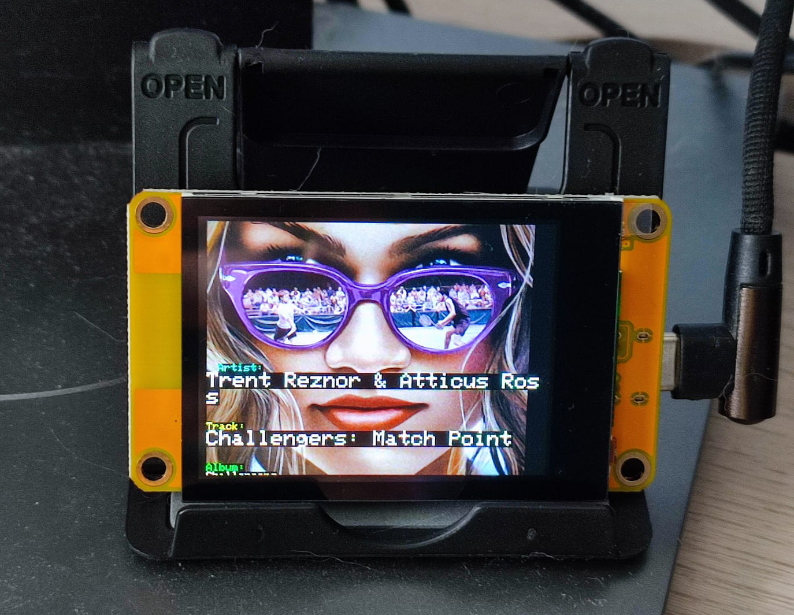

# ESP32 CYD Last.fm Now Playing Display

> Do you even scrobble, bro?

Showcase your musical taste in real-time! This project turns the inexpensive 2.2 inch ESP32-2432S022c (Cheap Yellow Display - CYD) into a dedicated Last.fm "Now Playing" display. It connects via WiFi, grabs your latest track info (artist, title, album) and album art from the Last.fm API, and puts it right onto the screen.

 

## Table of Contents
- [Features](#features)
- [Hardware Requirements](#hardware-requirements)
- [Software Requirements](#software-requirements)
- [Arduino Libraries (Dependencies)](#arduino-libraries--dependencies-)
- [Step-by-Step Setup & Installation](#step-by-step-setup---installation)
- [Configuration](#configuration)
- [Troubleshooting & Notes](#troubleshooting---notes)
- [Resources & Links](#resources---links)
- [Contact](#contact)

## Features

* **Live "Now Playing" Display:** Shows your current Last.fm track in near real-time.
* **Track Details:** Displays Artist, Track Title, and Album Name.
* **Album Cover Art:** Fetches and renders album covers (JPG or PNG).
* **Budget-Friendly Hardware:** Runs on the inexpensive ESP32-2432S022c (specifically the 2.2" CYD version).
* **WiFi Connectivity:** Connects to your wireless network.
* **Optimized Updates:** Checks if the track has actually changed before redrawing the screen, saving resources and preventing flicker. If next track from the same album is played - software only rewrites track, not refreshing whole screen.
* **Energy saving:** Turns off the screen if the music is not playing for 30+ seconds.
* **Powerful Graphics:** Uses the `LovyanGFX` library for smooth TFT display driving.
* **Status Feedback:** Shows WiFi connection progress and error messages directly on the TFT.

## Hardware Requirements

* **Board:** ESP32-2432S022c (The **2.2" 240x320 TFT** version - e.g., from [Temu](https://share.temu.com/P4PLVBPsGsA) for ~$11). Also known as CYD (Cheap Yellow Display).
* **Cable:** USB-A to USB-C cable (The manufacturer reportedly advises against USB-C to USB-C cables, so A-to-C is recommended).

## Software Requirements

* **Arduino IDE:** Latest stable version recommended. [Download here](https://www.arduino.cc/en/software).
* **CH340 Driver:** Essential for your computer to communicate with the board via USB. Search "CH340 driver" and install the version for your OS (Windows/Mac/Linux). You might find drivers [here](https://sparks.gogo.co.nz/ch340.html) or from the manufacturer.
* **ESP32 Board Support for Arduino IDE:** Definitions for the ESP32 chip family.

## Arduino Libraries (Dependencies)

Make sure you have the following libraries installed in your Arduino IDE (Tools -> Manage Libraries...):

* **`LovyanGFX` by lovyan03:** **Absolutely essential!** For this specific board (ESP32-2432S022c 2.2") and this code, you **must** use `LovyanGFX`. Ignore guides suggesting `TFT_eSPI` for the CYD if you're using this code, as driver configurations differ significantly.
* **`ArduinoJson` by Benoit Blanchon:** For parsing the JSON response from the Last.fm API.
* `WiFi`: Built-in with the ESP32 core.
* `HTTPClient`: Built-in with the ESP32 core (LovyanGFX uses this internally for its `drawJpgUrl`/`drawPngUrl` functions).

## Step-by-Step Setup & Installation

1.  **Install CH340 Driver:** If you haven't already, [download and install the CH340 driver](https://sparks.gogo.co.nz/ch340.html). Your computer probably won't recognize the board without it.
2.  **Install Arduino IDE:** Download and install the Arduino IDE from [arduino.cc](https://www.arduino.cc/en/software).
3.  **Add ESP32 Boards Manager URL:**
    * In Arduino IDE, go to: `File` > `Preferences`.
    * In the "Additional Boards Manager URLs" field, paste the following link:
        ```
        [https://raw.githubusercontent.com/espressif/arduino-esp32/gh-pages/package_esp32_index.json](https://raw.githubusercontent.com/espressif/arduino-esp32/gh-pages/package_esp32_index.json)
        ```
    * Click OK.
4.  **Install ESP32 Boards:**
    * Go to: `Tools` > `Board` > `Boards Manager...`.
    * Search for "esp32".
    * Install "esp32 by Espressif Systems". Use a recent, stable version.
5.  **Select Board and Port:**
    * Go to: `Tools` > `Board` > `ESP32 Arduino` > **`ESP32 Dev Module`**. (This is a good generic choice).
    * Go to: `Tools` > `Port` and select the COM port corresponding to your connected ESP32 (It might mention CH340).
6.  **Install Libraries:**
    * Go to: `Tools` > `Manage Libraries...`.
    * Search for and install `LovyanGFX` and `ArduinoJson`.
7.  **Configure `LovyanGFX` (If Needed):**
    * This code includes `"LGFX.h"`. This file typically contains the specific pin and driver configuration for your board variant (ESP32-2432S022c).
    * Ensure you have the correct `LGFX.h` file for your board within the project directory or that your LovyanGFX library installation is set up correctly for the `esp32-2432s022c`. Check the LovyanGFX documentation or examples if the display doesn't work out-of-the-box. The correct configuration is *vital*.
8.  **Download/Clone Project Code:** Get all project files (see **Project structure** below).
9.  **Configure Credentials:** See the "Configuration" section below. This is **required**!
10. **Put `lv_conf.h` file in the right place:** The `lv_conf.h` file from the repository must be in your `Arduino/libraries` directory (next to the `LovyanGFX` folder).
11. **Upload Code:** Open `lastFmNowPlaying/lastFmNowPlaying.ino` in the Arduino IDE and click Upload.

### Project structure (lastFmNowPlaying folder)

| File | Role |
|------|------|
| `lastFmNowPlaying.ino` | Main sketch: `setup()` and `loop()` only. |
| `config.example.h` | Template for credentials — copy to `config.h` and edit. |
| `config.h` | Your WiFi and API keys (create from example; **do not commit**). |
| `apiConfig.h` | Last.fm and Cover Art Archive API constants. |
| `userSettings.h` | Display size, refresh interval, layout, typography. |
| `LGFX.h` | LovyanGFX panel/bus configuration for your board. |
| `WiFiManager.h` / `.cpp` | Serial init, WiFi connect, NTP sync, reconnect. |
| `Display.h` / `Display.cpp` | TFT init, “now playing” screen, text/cover drawing. |
| `fetch.h` / `Fetch.cpp` | HTTP JSON fetch, album cover URL resolution (Last.fm, CAA, JPG converter). |
| `LastFmApp.h` / `LastFmApp.cpp` | Fetch + display logic, display on/off timeout, track change detection. |

## Configuration

Before uploading, you **must** configure your WiFi and Last.fm details:

1.  **Get a Last.fm API Key:** Create an account and an API key at [https://www.last.fm/api/account/create](https://www.last.fm/api/account/create).
2.  **Create `config.h`:**
    * In the `lastFmNowPlaying` folder, copy `config.example.h` to `config.h`.
3.  **Edit `config.h`:**
    * Set `WIFI_SSID` and `WIFI_PASSWORD` to your WiFi credentials.
    * Set `LASTFM_APIKEY` and `LASTFM_USERNAME` to your Last.fm API key and username.
    * Optionally set the JPG converter and bucket URLs if you use the progressive-JPG converter (see Troubleshooting).
4.  **Save the files.** You can then upload the sketch.

## Troubleshooting & Notes

* **Display Issues:** **USE LOVYANGFX!** Seriously, this is the most common issue. Don't use TFT_eSPI examples for this board/code. Double-check your `LGFX.h` or LovyanGFX setup is correct for the `esp32-2432s022c` (2.2 inch version). Board versions (2.2" vs 2.4"/2.8") can have different pinouts or drivers!
* **Connection Problems:** Verify WiFi SSID and password in `config.h`. Check your WiFi signal strength. Ensure the CH340 driver is correctly installed if uploads fail or the serial monitor doesn't connect.
* **USB Cable:** Remember the recommendation for USB-A to USB-C.
* **"No recent tracks found":** Make sure you're actively scrobbling on Last.fm and your username/API key in `config.h` are correct. Check the Last.fm API status online if problems persist.
* **JSON Errors / HTTP Errors:** Could be temporary Last.fm API issues, WiFi instability, or sometimes memory issues (though the code tries to be efficient). Check the Serial Monitor output in Arduino IDE (Tools > Serial Monitor, set baud rate to 115200) for detailed error messages.
* **Image Loading Failures (`JPG Fail`/`PNG Fail`):** LovyanGFX's `drawJpgUrl`/`drawPngUrl` rely on `HTTPClient`. This should work fine with the standard ESP32 core setup. Ensure the URL from Last.fm is valid (check Serial Monitor). Some complex images or server issues might cause occasional failures. Free RAM is monitored in the serial output around image drawing; very low RAM could be an issue.
* **Cover Art Archive (CAA) Usage for JPEGs**: While PNG album covers from the Last.fm API generally display without issues, JPEGs present a challenge. Many JPEGs provided directly by Last.fm are in the *progressive* format. Decoding progressive JPEGs demands significantly more RAM than the *baseline* format, often causing memory exhaustion and display failures on constrained devices like the ESP32. Therefore, when a PNG cover isn't available from Last.fm, this application falls back to using the Cover Art Archive (CAA) API (looking up covers via MusicBrainz MBIDs obtained from Last.fm data). The CAA API is preferred in these cases because it typically provides album covers as more memory-friendly *baseline* JPEGs.
* **CAA Redirects**: A challenge with the CAA API is handling HTTP redirects. The initial API request often redirects to the actual image URL. The code includes logic (`findFinalImageUrl` in `helpers.h`) to follow these redirects and obtain the final image link. Occasional failures might still occur due to server issues, complex redirect chains, or temporary network problems.

## Resources & Links

* **CYD Setup Guide (Reference):** [witnessmenow/ESP32-Cheap-Yellow-Display SETUP.md](https://github.com/witnessmenow/ESP32-Cheap-Yellow-Display/blob/main/SETUP.md) (**IMPORTANT:** Ignore the specific setup instructions for the `TFT_eSPI` library mentioned there; use `LovyanGFX` as described above!)
* **3D Printed Case:** [ESP32-2432S022C Case on MakerWorld](https://makerworld.com/en/models/1216297-esp32-2432s022c-case)
* **Last.fm API Docs:** [user.getRecentTracks Method](https://www.last.fm/api/show/user.getRecentTracks)
* **Cover Art Archive API Docs:** [release Method](https://musicbrainz.org/doc/Cover_Art_Archive/API#/release/%7Bmbid%7D/)
* **LovyanGFX Library:** [GitHub Repository](https://github.com/lovyan03/LovyanGFX)

## Contact
For questions or feedback, please reach out via GitHub.
[ifmcjthenknczny](https://github.com/ifmcjthenknczny)